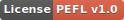
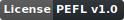

# ⚖️ PEFL - 個人および教育用フリーライセンス

🇬🇧 **[Read this README in English](../README.md)**

**個人および教育用フリーライセンス (PEFL)** は、ソフトウェアプロジェクトを許可のない商業的および企業的な搾取から保護するために設計された、単一著者による最新のカスタムライセンスです。個人、学術、非営利目的の利用には100%無償でのアクセスを提供する一方、商用利用を行う企業には書面による許諾の取得とライセンス料の支払いを義務付けています。

さらに、PEFLは、ユーザーがソフトウェアを使用する前に条件を明示的に認識できるように、ユニークな**起動時のユーザー承認義務の条項**を備えています。

---

## 🌐 公式翻訳

PEFL v1.0 ライセンス本文および関連ドキュメントの言語を選択してください：

| 言語 | 公式ライセンス本文 | 翻訳版 README |
| :--- | :---: | :---: |
| 🇬🇧 **English** | [LICENSE](../LICENSE) | [English (Master)](../README.md) |
| 🇮🇹 **Italiano** | [LICENSE.it](../LICENSE.it) | [Leggi in Italiano](README_IT.md) |
| 🇫🇷 **Français** | [LICENSE.fr](../LICENSE.fr) | [Lire en Français](README_FR.md) |
| 🇪🇸 **Español** | [LICENSE.es](../LICENSE.es) | [Leer en Español](README_ES.md) |
| 🇩🇪 **Deutsch** | [LICENSE.de](../LICENSE.de) | [Lesen auf Deutsch](README_DE.md) |
| 🇵🇹 **Português** | [LICENSE.pt](../LICENSE.pt) | [Ler em Português](README_PT.md) |
| 🇷🇺 **Русский** | [LICENSE.ru](../LICENSE.ru) | [Читать на Русском](README_RU.md) |
| 🇹🇷 **Türkçe** | [LICENSE.tr](../LICENSE.tr) | [Türkçe Oku](README_TR.md) |
| 🇸🇦 **العربية** | [LICENSE.ar](../LICENSE.ar) | [اقرأ بالعربية](README_AR.md) |
| 🇯🇵 **日本語** | [LICENSE.ja](../LICENSE.ja) | [日本語で読む](README_JA.md) |
| 🇰🇷 **한국어** | [LICENSE.ko](../LICENSE.ko) | [한국어로 읽기](README_KO.md) |
| 🇮🇳 **हिन्दी** | [LICENSE.hi](../LICENSE.hi) | [हिन्दी में पढ़ें](README_HI.md) |
| 🇧🇩 **বাংলা** | [LICENSE.bn](../LICENSE.bn) | [বাংলায় পড়ুন](README_BN.md) |
| 🇵🇰 **اردو** | [LICENSE.ur](../LICENSE.ur) | [اردو میں پڑھیں](README_UR.md) |
| 🇨🇳 **中文** | [LICENSE.zh](../LICENSE.zh) | [中文阅读](README_ZH.md) |
| 🌐 **Esperanto** | [LICENSE.eo](../LICENSE.eo) | [Legi en Esperanto](README_EO.md) |

---

## 🤖 AI コーディングアシスタント向け命令

アプリケーションのコーディングやリファクタリングにAIエージェント（Cursor、GitHub Copilot、Gemini、ChatGPTなど）を使用する場合は、専用の [AI_INSTRUCTIONS.md](../AI_INSTRUCTIONS.md) ファイルをそれらに読み込ませる必要があります。

このファイルは、AIアシスタントに対して、PEFLの条件を尊重し、ファイルヘッダーを維持し、条項3を適用するように指示するシステムプロンプト／ルールディレクティブとして機能します。

---

## 🌟 核心となる哲学

従来のオープンソースライセンスでは、数十億ドル規模の企業が個人開発者のプロジェクトを商用化し、見返りを与えないことが許されていました。PEFLは明確な境界を設定することで、この問題を解決します：

| 組織タイプ | 無償利用の可否 | 書面による許諾とライセンス料の要否 |
| :--- | :---: | :---: |
| **ホビイスト＆個人** | 🟢 可能 | ❌ 不要 |
| **学生＆研究者** | 🟢 可能 | ❌ 不要 |
| **学校＆大学** | 🟢 可能 | ❌ 不要 |
| **非営利団体 (NGO)** | 🟢 可能 | ❌ 不要 |
| **企業＆プロフェッショナルユーザー** | ❌ 不可 | 🟢 必要 |
| **礼拝所＆宗教団体** | ❌ 不可 | 🟢 必要 |

---

## ⚙️ プロジェクトに PEFL を適用する方法

プロジェクトに PEFL を適用する手順は以下の5つのステップです：

### 1. ライセンスファイルのコピー
リポジトリのルートディレクトリに [LICENSE](../LICENSE) ファイル（および／または上記のローカライズされた翻訳）を追加します。また、概要ファイル [NOTICE.md](../templates/NOTICE.md) も追加します。

### 2. ファイルヘッダーの追加
すべてのソースファイルの先頭に公式のヘッダー通知を挿入します。
- **英語**: [header.txt](../templates/header.txt)
- **イタリア語**: [header_IT.txt](../templates/header_IT.txt)

### 3. 条項3の遵守（起動時の EULA チェック）
PEFLの条項3は以下のように規定しています：
> *「本ライセンスは、本ソフトウェアの起動ごとに常に最前面で視認可能でなければならず（ただし、承認日を安全に保存するためのローカル永続化メカニズムが利用可能な場合は、少なくとも7日に1回）、利用する前にユーザーによって明示的に承認されなければなりません。」*

この条件を満たすには、ソフトウェアの起動前にユーザーにライセンスへの同意を求める必要があります。[templates/](../templates/) フォルダにある公式テンプレートのいずれかを使用してください：
- **Bash / Linux / Unix**: [pefl-license-approval-cli.sh](../templates/pefl-license-approval-cli.sh)
- **Zsh / macOS**: [pefl-license-approval-cli-macos.zsh](../templates/pefl-license-approval-cli-macos.zsh)
- **PowerShell (Windows／クロスプラットフォーム)**: [pefl-license-approval-cli.ps1](../templates/pefl-license-approval-cli.ps1)
- **Windows CMD Batch**: [pefl-license-approval-cli.bat](../templates/pefl-license-approval-cli.bat)
- **Python / コンソール**: [pefl-license-approval-cli.py](../templates/pefl-license-approval-cli.py)
- **JavaScript / Web**: [pefl-license-approval-web.js](../templates/pefl-license-approval-web.js)

### 4. パッケージマネージャーの設定
[templates/package-metadata.md](../templates/package-metadata.md) の指示に従って、npm (`package.json`)、Python (`pyproject.toml`)、または Cargo (`Cargo.toml`) でパッケージのライセンスステータスを宣言します。

### 5. バッジの表示
リポジトリの README.md に公式バッジを追加して、訪問者に PEFL の条件を明確に宣言します。

---

## ❓ よくある質問 (FAQ)

### PEFL は標準的なオープンソースライセンスですか？
いいえ。PEFL は OSI 承認ライセンスではありません。商用利用を制限しているため、「Source-Available」または「Fair-Code」ライセンスに分類されます。

### なぜ宗教団体が個人利用から除外されているのですか？
PEFL において、礼拝所および宗教団体は企業利用と同等とみなされます。これにより、著者はこれらの団体に対する配布および利用規約をコントロールする権利を保持します。

### PEFL プロジェクトをフォークすることはできますか？
はい、個人利用の範囲内であれば、PEFLライセンスのソフトウェアを自由にフォークして変更することができます。ただし、条項5により、著者の書面による同意なしに、変更されたコードを別のライセンスで再配布することは禁止されています。

---

## ✉️ ライセンスと連絡先

商用ライセンス、企業向け見積もり、またはコンプライアンスに関するご質問は、著者に直接お問い合わせください：
- **著者**: Rubens Rainelli
- **メールアドレス**: rubens@rainelli.it
- **GitHub**: [RubensRainelli](https://github.com/RubensRainelli/)
- **電話番号**: (+39) 342 811 5882
